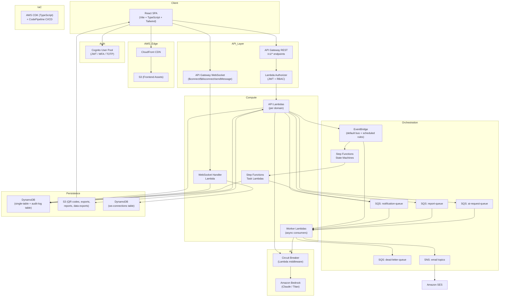
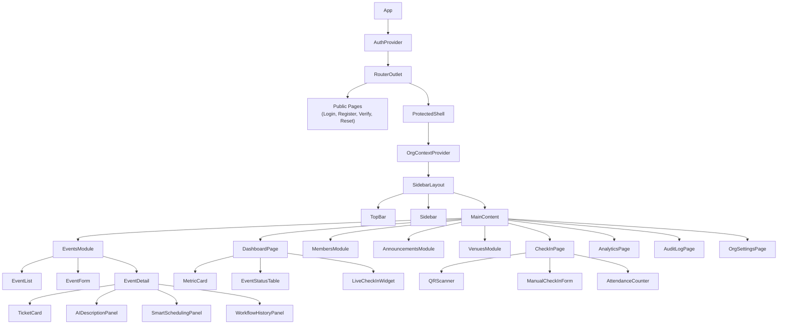
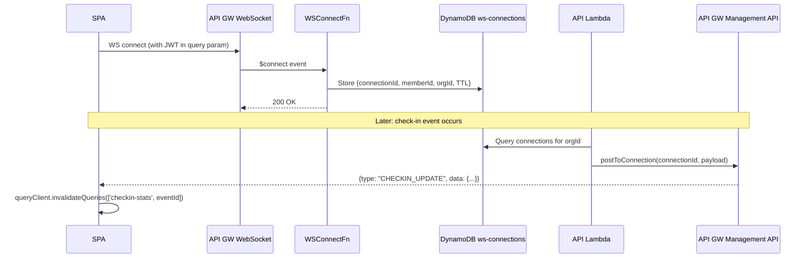
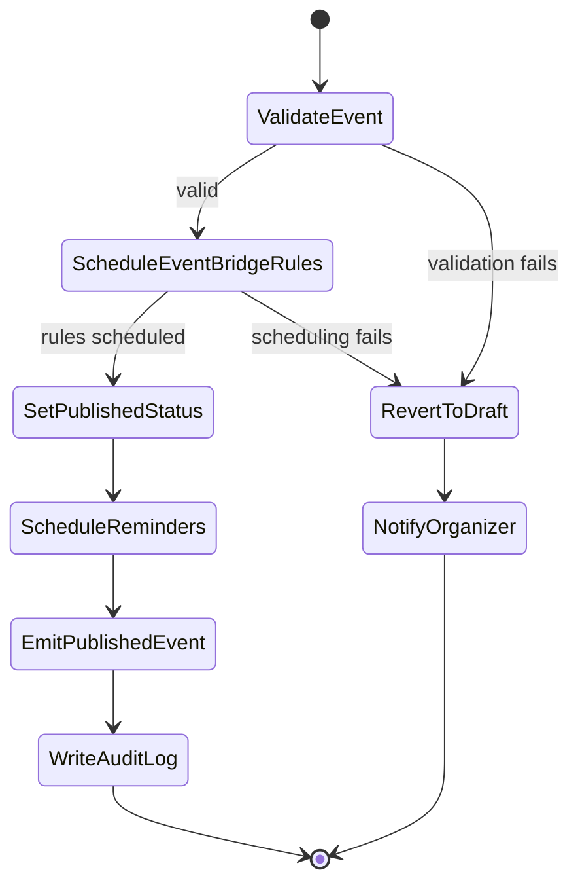
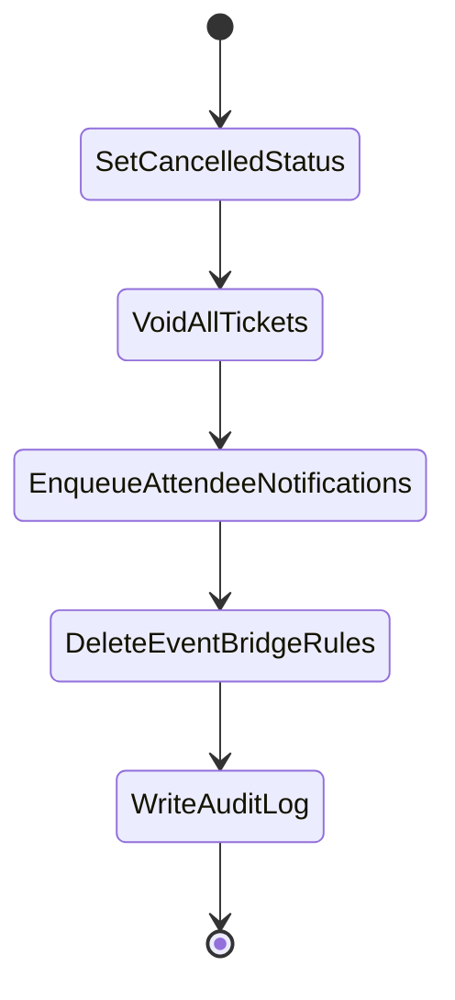
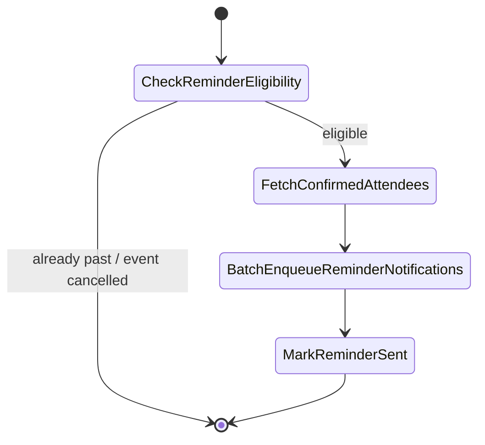
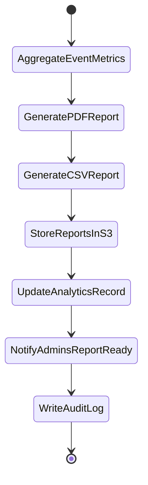
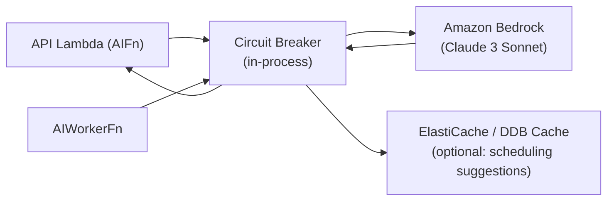
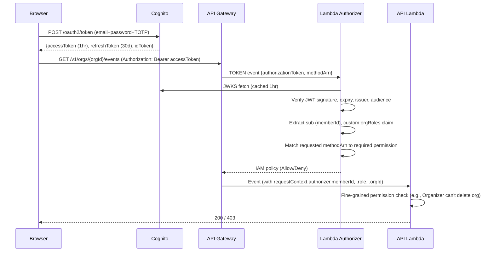

# Design Document

## Community Lifecycle Orchestration and Intelligence System (CLOIS)

---

## Overview

CLOIS is a multi-tenant SaaS platform built on a React + TypeScript + Tailwind CSS SPA frontend backed by a fully serverless AWS backend. The system manages the complete lifecycle of community events — from org onboarding and member management through event creation, RSVP, live check-in, analytics, workflow automation, and AI-assisted content and scheduling.

### Key Architectural Principles

- **Serverless-first**: Lambda + API Gateway for compute; DynamoDB for persistence; S3 for assets; EventBridge + SQS/SNS for messaging; Step Functions for orchestration.
- **Multi-tenant isolation**: Every API request is scoped to a tenant (Organization). Tenant context is derived from the verified JWT and enforced at the Lambda layer, never trusted from the client.
- **Event-driven**: Domain events flow through EventBridge. Downstream consumers (notification dispatch, report generation, audit logging) are decoupled via SQS queues.
- **AI as an optional accelerator**: Amazon Bedrock is accessed through a circuit-breaker wrapper. AI features are never on the critical path for core CRUD operations.
- **RBAC server-side only**: Client-side permission hints are UI affordances. All permission checks happen in Lambda before any DynamoDB access.

---

## Architecture

### System Component Diagram



### Request Flow (REST)

1. Browser sends `Authorization: Bearer <JWT>` to API Gateway `/v1/*`.
2. Lambda Authorizer validates JWT signature against Cognito JWKS, extracts `sub` (Member ID), `orgId` (from custom claim), and `role`.
3. Authorizer returns an IAM policy allowing/denying the target Lambda ARN.
4. API Lambda performs a fine-grained RBAC check (role vs. required permission), executes business logic, reads/writes DynamoDB, and may publish to EventBridge or enqueue to SQS.
5. Asynchronous side-effects (notifications, analytics) are processed by Worker Lambdas triggered from SQS.

### Real-Time Flow (WebSocket)

1. SPA connects to the WebSocket API Gateway endpoint.
2. `$connect` Lambda stores the connection ID + Member ID in `ws-connections` DynamoDB table with a TTL of 2 hours.
3. API Lambdas and Worker Lambdas push updates to relevant connections via `ApiGatewayManagementApi.postToConnection`.
4. `$disconnect` Lambda removes the connection record.

---

## Frontend Architecture

### Technology Stack

| Concern | Choice |
|---|---|
| Framework | React 18 + TypeScript 5 |
| Build tool | Vite 5 |
| Styling | Tailwind CSS 3 + shadcn/ui components |
| Routing | React Router v6 (data router) |
| State management | Zustand (global: auth, org context) + TanStack Query v5 (server state) |
| Forms | React Hook Form + Zod schemas |
| Real-time | WebSocket via a custom `useWebSocket` hook |
| Calendar export | ics (npm package) |
| QR display | react-qr-code |
| Testing | Vitest + Testing Library + fast-check (PBT) |

### Routing Structure

```
/                          → redirect to /dashboard or /login
/login                     → LoginPage
/register                  → RegisterPage
/verify-email              → EmailVerificationPage
/forgot-password           → ForgotPasswordPage
/reset-password            → ResetPasswordPage
/accept-invite/:token      → AcceptInvitePage
/orgs/new                  → CreateOrgPage
/orgs/:orgSlug             → OrgShell (layout)
  /dashboard               → DashboardPage
  /events                  → EventsListPage
  /events/new              → CreateEventPage
  /events/:eventId         → EventDetailPage
  /events/:eventId/edit    → EditEventPage
  /events/:eventId/checkin → CheckInPage
  /events/:eventId/analytics → AnalyticsPage
  /members                 → MembersPage
  /announcements           → AnnouncementsPage
  /announcements/new       → CreateAnnouncementPage
  /venues                  → VenuesPage
  /venues/new              → CreateVenuePage
  /audit-log               → AuditLogPage (Admin+)
  /settings                → OrgSettingsPage (Owner)
/profile                   → ProfilePage
/profile/data-export       → DataExportPage
```

### React Component Hierarchy



### State Management

- **AuthStore (Zustand)**: `{ user, tokens, refreshToken, isAuthenticated }`. Initialized from `localStorage`; refreshed via Cognito SDK on expiry.
- **OrgStore (Zustand)**: `{ currentOrg, role, permissions }`. Set when user navigates into an org shell.
- **Server state (TanStack Query)**: All API data (events, members, tickets, analytics) is managed through query keys scoped by `orgId`. Stale-while-revalidate with a 30-second `staleTime` for dashboard data, 5-minute `staleTime` for static lists.
- **WebSocket updates**: Incoming messages trigger `queryClient.invalidateQueries()` for the relevant query keys, keeping the UI reactive without polling.

---

## Backend Architecture

### Lambda Function Inventory

Each Lambda function is scoped to one domain and deployed as an individual function with its own IAM execution role following least-privilege.

| Domain | Function | Trigger | Description |
|---|---|---|---|
| Auth | `AuthorizerFn` | API GW (token authorizer) | JWT validation + RBAC policy generation |
| Orgs | `OrgsFn` | API GW REST | CRUD for Organizations |
| Members | `MembersFn` | API GW REST | Invite, role change, remove members |
| Events | `EventsFn` | API GW REST | Event CRUD, lifecycle transitions |
| Venues | `VenuesFn` | API GW REST | Venue CRUD |
| Tickets | `TicketsFn` | API GW REST | RSVP, waitlist, cancellation |
| CheckIn | `CheckInFn` | API GW REST | QR scan + manual check-in |
| Announcements | `AnnouncementsFn` | API GW REST | Create + audience-targeted delivery |
| Notifications | `NotificationsFn` | API GW REST | Read/mark-read notifications |
| Analytics | `AnalyticsFn` | API GW REST | Report read + export request |
| AuditLog | `AuditLogFn` | API GW REST | Paginated audit log queries |
| AI | `AIFn` | API GW REST | Description gen, scheduling, sentiment |
| Calendar | `CalendarFn` | API GW REST | iCalendar file generation |
| DataPrivacy | `DataPrivacyFn` | API GW REST | Export request, deletion request |
| WebSocket | `WSConnectFn` | API GW WS $connect | Register connection |
| WebSocket | `WSDisconnectFn` | API GW WS $disconnect | Deregister connection |
| WebSocket | `WSMessageFn` | API GW WS $default | Route inbound WS messages |
| Worker | `NotificationWorkerFn` | SQS (notification-queue) | Email dispatch via SES + in-app persist |
| Worker | `ReportWorkerFn` | SQS (report-queue) | Analytics report generation |
| Worker | `AIWorkerFn` | SQS (ai-request-queue) | Async Bedrock calls |
| Step Functions | `EventTransitionFn` | SFN task | Apply Event state transition |
| Step Functions | `ReminderFn` | SFN task | Send reminder notifications |
| Step Functions | `PostEventReportFn` | SFN task | Trigger report generation |
| Step Functions | `CancellationFn` | SFN task | Void tickets + notify attendees |
| EventBridge | `SchedulerFn` | EB scheduled rules | Invoke SFN executions for timed transitions |

### API Route Map (grouped by domain)

All routes are prefixed `/v1/`.

#### Auth
```
POST   /v1/auth/register
POST   /v1/auth/verify-email
POST   /v1/auth/login
POST   /v1/auth/refresh
POST   /v1/auth/logout
POST   /v1/auth/forgot-password
POST   /v1/auth/reset-password
PUT    /v1/auth/mfa/enable
PUT    /v1/auth/mfa/disable
```

#### Organizations
```
POST   /v1/orgs
GET    /v1/orgs/{orgId}
PUT    /v1/orgs/{orgId}
POST   /v1/orgs/{orgId}/deactivate
POST   /v1/orgs/{orgId}/transfer-ownership
```

#### Members
```
POST   /v1/orgs/{orgId}/invitations
POST   /v1/orgs/{orgId}/invitations/bulk
GET    /v1/orgs/{orgId}/invitations/{invitationId}/accept   (public, token in path)
GET    /v1/orgs/{orgId}/members
PUT    /v1/orgs/{orgId}/members/{memberId}/role
DELETE /v1/orgs/{orgId}/members/{memberId}
```

#### Events
```
POST   /v1/orgs/{orgId}/events
GET    /v1/orgs/{orgId}/events
GET    /v1/orgs/{orgId}/events/{eventId}
PUT    /v1/orgs/{orgId}/events/{eventId}
POST   /v1/orgs/{orgId}/events/{eventId}/publish
POST   /v1/orgs/{orgId}/events/{eventId}/cancel
POST   /v1/orgs/{orgId}/events/{eventId}/transition   (Admin manual override)
```

#### Venues
```
POST   /v1/orgs/{orgId}/venues
GET    /v1/orgs/{orgId}/venues
GET    /v1/orgs/{orgId}/venues/{venueId}
PUT    /v1/orgs/{orgId}/venues/{venueId}
DELETE /v1/orgs/{orgId}/venues/{venueId}
```

#### Tickets & RSVP
```
POST   /v1/orgs/{orgId}/events/{eventId}/tickets
GET    /v1/orgs/{orgId}/events/{eventId}/tickets
GET    /v1/orgs/{orgId}/events/{eventId}/tickets/{ticketId}
DELETE /v1/orgs/{orgId}/events/{eventId}/tickets/{ticketId}
GET    /v1/orgs/{orgId}/events/{eventId}/waitlist
```

#### Check-In
```
POST   /v1/orgs/{orgId}/events/{eventId}/checkins
GET    /v1/orgs/{orgId}/events/{eventId}/checkins/stats
```

#### Announcements & Notifications
```
POST   /v1/orgs/{orgId}/announcements
GET    /v1/orgs/{orgId}/announcements
GET    /v1/me/notifications
PUT    /v1/me/notifications/{notificationId}/read
PUT    /v1/orgs/{orgId}/notifications/opt-out
```

#### Analytics
```
GET    /v1/orgs/{orgId}/events/{eventId}/analytics
POST   /v1/orgs/{orgId}/analytics/trend-report
GET    /v1/orgs/{orgId}/analytics/trend-report/{reportId}
GET    /v1/orgs/{orgId}/events/{eventId}/analytics/export?format=csv|pdf
```

#### AI
```
POST   /v1/orgs/{orgId}/ai/describe-event
POST   /v1/orgs/{orgId}/ai/suggest-schedule
POST   /v1/orgs/{orgId}/ai/analyze-sentiment
```

#### Workflow & Audit
```
GET    /v1/orgs/{orgId}/events/{eventId}/workflow-history
GET    /v1/orgs/{orgId}/audit-log
```

#### Calendar & Data Privacy
```
GET    /v1/orgs/{orgId}/events/{eventId}/tickets/{ticketId}/ical
POST   /v1/me/data-export
DELETE /v1/me/account
GET    /v1/orgs/{orgId}/admin/member-data-map?memberId=...
```

---

## Data Models

### DynamoDB Single-Table Design

**Table Name**: `clois-main`

The table uses a composite primary key with:
- **PK** (Partition Key): string
- **SK** (Sort Key): string

All items carry a `type` attribute for item filtering and a `tenantId` for isolation.

#### GSI Summary

| GSI | Partition Key | Sort Key | Purpose |
|---|---|---|---|
| GSI1 | `GSI1PK` | `GSI1SK` | Multi-purpose secondary lookups |
| GSI2 | `GSI2PK` | `GSI2SK` | Event status + org queries |
| GSI3 | `GSI3PK` | `GSI3SK` | Ticket lookups by member/event |
| GSI4 | `GSI4PK` | `GSI4SK` | Notification delivery queries |

#### Item Schemas

**Organization**
```
PK:  ORG#{orgId}
SK:  METADATA
type: ORGANIZATION
tenantId: {orgId}
orgId, name, slug, status (Active|Deactivated), createdAt, updatedAt
ownerMemberId, deactivatedAt?, deletionEligibleAt?
GSI1PK: SLUG#{slug}   GSI1SK: METADATA   (slug uniqueness lookup)
```

**OrgMembership** (Member ↔ Org relationship + role)
```
PK:  ORG#{orgId}
SK:  MEMBER#{memberId}
type: ORG_MEMBERSHIP
tenantId: {orgId}
memberId, role (Owner|Admin|Organizer|Member), status (Active|Removed), joinedAt
GSI1PK: MEMBER#{memberId}   GSI1SK: ORG#{orgId}   (list orgs for a member)
```

**Invitation**
```
PK:  ORG#{orgId}
SK:  INVITATION#{invitationId}
type: INVITATION
tenantId: {orgId}
invitationId, email, role, status (Pending|Accepted|Expired), token (hashed), expiresAt, createdAt
GSI1PK: TOKEN#{tokenHash}   GSI1SK: INVITATION   (accept-by-token lookup)
GSI2PK: ORG#{orgId}#EMAIL#{email}   GSI2SK: INVITATION   (duplicate check)
```

**Event**
```
PK:  ORG#{orgId}
SK:  EVENT#{eventId}
type: EVENT
tenantId: {orgId}
eventId, title, description?, status (Draft|Published|Open|In_Progress|Completed|Archived|Cancelled)
startAt (UTC ISO8601), endAt (UTC ISO8601), timezone (IANA)
capacity, confirmedCount, waitlistCount, checkedInCount
venueId?, venueType (Physical|Virtual), meetingUrl?, physicalAddress?
organizerId, createdAt, updatedAt
GSI2PK: ORG#{orgId}#STATUS#{status}   GSI2SK: EVENT#{startAt}#{eventId}
(query events by org+status, sorted by time)
GSI1PK: EVENT#{eventId}   GSI1SK: METADATA   (global event lookup)
```

**Venue**
```
PK:  ORG#{orgId}
SK:  VENUE#{venueId}
type: VENUE
tenantId: {orgId}
venueId, name, address, capacity, amenities[]
createdAt, updatedAt
```

**Ticket**
```
PK:  ORG#{orgId}#EVENT#{eventId}
SK:  TICKET#{ticketId}
type: TICKET
tenantId: {orgId}
ticketId, eventId, orgId
memberId? (null for guest), guestName?, guestEmail?
status (Confirmed|Cancelled|Voided|CheckedIn|Waitlisted)
ticketCode (UUID), qrCodeS3Key, qrCodeUrlExpiry
checkedInAt?, checkedInBy?, cancelledAt?
waitlistPosition? (integer, for Waitlisted status)
createdAt
GSI3PK: MEMBER#{memberId}     GSI3SK: TICKET#{createdAt}#{ticketId}
(list tickets for a member)
GSI3PK: EMAIL#{guestEmail}    GSI3SK: TICKET#{createdAt}#{ticketId}
(guest duplicate check — overloaded GSI3 partition)
GSI1PK: TICKETCODE#{ticketCode}   GSI1SK: TICKET
(check-in by QR scan)
```

**Notification**
```
PK:  MEMBER#{memberId}
SK:  NOTIFICATION#{createdAt}#{notificationId}
type: NOTIFICATION
tenantId: {orgId}
notificationId, memberId, orgId
notificationType (RSVPConfirmation|WaitlistPromotion|EventCancellation|Reminder|CapacityWarning|AnnouncementBroadcast|WorkflowFailure|ReportReady)
title, body, deepLinkUrl?
readAt?, deliveredEmailAt?, emailDeliveryStatus (Pending|Delivered|Failed)
createdAt
GSI4PK: ORG#{orgId}   GSI4SK: NOTIFICATION#{createdAt}#{notificationId}
(admin: all notifications for an org, for delivery tracking)
```

**Analytics Report**
```
PK:  ORG#{orgId}
SK:  REPORT#{eventId}
type: ANALYTICS_REPORT
tenantId: {orgId}
eventId, orgId
attendanceRate, checkInRate, waitlistCount, cancellationCount
registrationTimeSeries: [{timestamp, cumulativeCount}]
sentimentScore?, sentimentPositiveThemes[]?, sentimentNegativeThemes[]?
sentimentEntriesAnalyzed?, sentimentAnalyzedAt?
reportGeneratedAt, reportStatus (Generating|Ready|Failed)
csvS3Key?, pdfS3Key?
```

**Workflow Execution Record**
```
PK:  ORG#{orgId}
SK:  WORKFLOW#{eventId}#{workflowType}#{executionId}
type: WORKFLOW_EXECUTION
tenantId: {orgId}
executionId, eventId, workflowType (EventPublish|EventTransition|CancellationFlow|ReminderFlow|PostEventReport)
sfnExecutionArn, status (Running|Succeeded|Failed)
steps: [{name, status, startedAt, endedAt?, error?}]
startedAt, endedAt?
```

**WebSocket Connection**
```
Table: clois-ws-connections
PK: connectionId
SK: METADATA
memberId, orgId, connectedAt
TTL: connectedAt + 7200 (2 hours)
GSI: memberId → list connections for push
```

**Audit Log** (separate table for immutability)

```
Table: clois-audit-log
PK:  ORG#{orgId}
SK:  LOG#{timestamp}#{logId}
type: AUDIT_LOG_ENTRY
tenantId: {orgId}
logId, timestamp (UTC ISO8601), actor (memberId|"system")
targetType, targetId, operation, sourceIp, outcome (success|failure)
metadata: {}  (operation-specific details, no PII in AI entries)
GSI1PK: ORG#{orgId}#ACTOR#{actor}   GSI1SK: LOG#{timestamp}
(filter by actor)
GSI2PK: ORG#{orgId}#OP#{operation}  GSI2SK: LOG#{timestamp}
(filter by operation type)
```

#### Access Pattern Coverage

| Access Pattern | DynamoDB Operation |
|---|---|
| Get org by ID | `GetItem` PK=`ORG#{orgId}` SK=`METADATA` |
| Get org by slug (uniqueness) | `Query` GSI1 PK=`SLUG#{slug}` |
| List members of org | `Query` PK=`ORG#{orgId}` SK begins_with `MEMBER#` |
| List orgs for member | `Query` GSI1 PK=`MEMBER#{memberId}` |
| Accept invitation by token | `Query` GSI1 PK=`TOKEN#{hash}` |
| List events by org + status | `Query` GSI2 PK=`ORG#{orgId}#STATUS#{status}` sort by SK |
| Get event by ID | `Query` GSI1 PK=`EVENT#{eventId}` or `GetItem` with known orgId |
| List tickets for event | `Query` PK=`ORG#{orgId}#EVENT#{eventId}` SK begins_with `TICKET#` |
| Ticket by QR code | `Query` GSI1 PK=`TICKETCODE#{code}` |
| Member duplicate ticket check | `Query` GSI3 PK=`MEMBER#{memberId}` filter eventId |
| Notifications for member | `Query` PK=`MEMBER#{memberId}` SK begins_with `NOTIFICATION#` |
| Audit log filtered by org+date | `Query` PK=`ORG#{orgId}` SK begins_with `LOG#{datePrefix}` |
| Audit log filtered by actor | `Query` GSI1 PK=`ORG#{orgId}#ACTOR#{actor}` |
| Analytics report for event | `GetItem` PK=`ORG#{orgId}` SK=`REPORT#{eventId}` |


---

## Real-Time Architecture

### Approach: API Gateway WebSocket API

CLOIS uses AWS API Gateway WebSocket API for real-time updates. This provides a persistent bidirectional channel without the operational overhead of managing WebSocket servers on EC2/ECS.



### Connection Management

- **JWT in query string** on connect (`?token=<access_token>`); validated by the `$connect` Lambda.
- **TTL**: Connection records expire after 2 hours (DynamoDB TTL). SPA reconnects automatically on `close` event with exponential backoff.
- **Stale connection handling**: If `postToConnection` returns `GoneException` (410), the Worker Lambda deletes the stale connection record from DynamoDB.
- **Connection scope**: One connection per browser tab. The SPA subscribes to the `orgId`-scoped channel derived from its active org context.

### Real-Time Event Types

| Type | Payload | Consumer |
|---|---|---|
| `CHECKIN_UPDATE` | `{eventId, checkedInCount, capacity}` | CheckInPage, Dashboard |
| `EVENT_STATUS_CHANGE` | `{eventId, newStatus}` | EventDetail, EventList |
| `NOTIFICATION` | `{notificationId, title, body}` | Notification bell |
| `CAPACITY_WARNING` | `{eventId, percentage}` | Dashboard, CheckInPage |
| `REPORT_READY` | `{reportId, downloadUrl}` | Analytics page |

### Dashboard Polling Fallback

If the WebSocket connection is unavailable, the SPA falls back to polling the REST API at 30-second intervals for dashboard widgets (per Requirement 9.5/9.6 staleness handling).

---

## Workflow Automation Design

### Step Functions State Machines

#### 1. Event Publish Workflow

Triggered when an Organizer publishes an Event. Ensures EventBridge rules are scheduled atomically with the state transition.



#### 2. Event Cancellation Workflow

Triggered when an Organizer cancels a Published/Open/In_Progress Event.



#### 3. Reminder Workflow

Triggered by EventBridge scheduled rules at T-24h and T-1h before Event start.



#### 4. Post-Event Report Workflow

Triggered when Event transitions to Completed.



### Retry Configuration

All Step Functions tasks use the following retry policy (per Requirement 11.6):

```json
{
  "Retry": [{
    "ErrorEquals": ["States.TaskFailed", "Lambda.ServiceException", "Lambda.AWSLambdaException"],
    "IntervalSeconds": 5,
    "MaxAttempts": 3,
    "BackoffRate": 2.0
  }],
  "Catch": [{
    "ErrorEquals": ["States.ALL"],
    "Next": "MarkWorkflowFailed"
  }]
}
```

### EventBridge Scheduled Rules

For each published Event, two scheduled rules are created:

- **`event-{eventId}-start`**: Targets `SchedulerFn` Lambda at `startAt`. Lambda transitions Event to `In_Progress`.
- **`event-{eventId}-end`**: Targets `SchedulerFn` Lambda at `endAt`. Lambda transitions Event to `Completed` and starts Post-Event Report SFN.

Rules are deleted when the Event is cancelled or archived (within 30 seconds per Req 11.4).

---

## AI Integration Design

### Architecture Overview

Amazon Bedrock is accessed from Lambda functions through a **circuit breaker middleware** layer. AI is never on the critical path for core data mutations.



### Circuit Breaker Semantics (Requirement 21.4)

Implemented as a middleware class in Lambda shared layer (`/opt/circuitBreaker`):

- **State**: `CLOSED` (normal) → `OPEN` (blocking) → `HALF_OPEN` (probe)
- **Opening condition**: 5 consecutive failures within 60-second window
- **OPEN duration**: 120 seconds before transitioning to HALF_OPEN
- **HALF_OPEN**: Allow 1 request through; success → CLOSED; failure → back to OPEN
- **State persistence**: DynamoDB item with TTL (avoids in-memory-only loss on Lambda cold start)

```typescript
// Pseudocode for the circuit breaker state item
interface CircuitBreakerState {
  service: string;           // "bedrock"
  state: "CLOSED" | "OPEN" | "HALF_OPEN";
  consecutiveFailures: number;
  lastFailureWindowStart: number;  // Unix timestamp
  openedAt?: number;
  ttl: number;               // DynamoDB TTL
}
```

### Prompt Engineering

**Description Generation (Req 12):**
- Input: `{ title, keywords[], targetAudience }`
- Prompt template ensures no PII insertion. The prompt is assembled from event metadata only — never from member records.
- Output validation: word count check (100–500 words) before returning to caller.

**Smart Scheduling (Req 13):**
- Input: aggregated historical event statistics (day of week × time slot → avg attendance rate)
- Data is pre-aggregated in Lambda before sending to Bedrock. No raw member data is transmitted.
- Output: up to 5 `{ slot: datetime, predictedAttendance: number, reasons: string[] }` objects.
- Output validation: each `predictedAttendance` must be in [0, 100]; sorted descending.

**Sentiment Analysis (Req 14):**
- Input: array of anonymized feedback text strings (PII stripped before sending: emails, member IDs, names removed via regex + NER layer in Lambda).
- Maximum 500 entries; if more, use 500 most recent.
- Output: `{ score: number, positiveThemes: string[3], negativeThemes: string[3] }`
- Output validation: `score` clamped to [-1.0, 1.0]; exactly 3 themes each.

### Bedrock Model Selection

| Use Case | Model | Max Tokens |
|---|---|---|
| Description generation | Claude 3 Sonnet | 1024 |
| Smart scheduling | Claude 3 Haiku (cost-effective) | 512 |
| Sentiment analysis | Claude 3 Sonnet | 1024 |

---

## Security Design

### Authentication Flow



### JWT Claims Structure

Custom Cognito User Pool attributes:
- `custom:memberId`: Internal UUID for the Member
- `custom:orgRoles`: JSON map `{ "orgId": "Admin", "orgId2": "Member" }` (updated on role change)

The Lambda Authorizer extracts the role for the `{orgId}` path parameter from `custom:orgRoles`.

### IAM Roles (Least-Privilege)

Each Lambda function has its own IAM execution role. Example for `TicketsFn`:

```
Allow: dynamodb:GetItem, PutItem, UpdateItem, Query
       Resource: clois-main table + GSI1, GSI3
Allow: s3:PutObject, GetObject
       Resource: clois-assets bucket/qr-codes/*
Allow: sqs:SendMessage
       Resource: notification-queue
Deny: dynamodb:DeleteItem, Scan (on audit-log table)
```

### Audit Log Immutability

The `clois-audit-log` DynamoDB table has a resource-based policy that denies `dynamodb:DeleteItem` and `dynamodb:UpdateItem` to all IAM roles except the DBA break-glass role. Application IAM roles have `PutItem` only.

### HTTPS Enforcement

CloudFront distribution has `ViewerProtocolPolicy: redirect-to-https`. API Gateway is HTTPS-only by default. The `DataPrivacyFn` Lambda handles the 301 redirect requirement for any HTTP direct-to-API hits (Req 17.6).

### Multi-Tenant Isolation Enforcement

Every API Lambda reads `tenantId` exclusively from `requestContext.authorizer.orgId` (set by the Lambda Authorizer from the JWT claim). Path parameters are used only for DynamoDB key construction. All DynamoDB queries include `tenantId` as a filter/condition expression in addition to the PK. Cross-tenant queries are structurally impossible because the PK always includes `ORG#{orgId}`.

---

## Infrastructure as Code

### AWS CDK (TypeScript)

All infrastructure is defined as AWS CDK TypeScript constructs, organized into stacks:

```
infrastructure/
├── bin/
│   └── clois.ts              # CDK app entry point
├── lib/
│   ├── stacks/
│   │   ├── DatabaseStack.ts  # DynamoDB tables, GSIs
│   │   ├── StorageStack.ts   # S3 buckets + lifecycle policies
│   │   ├── AuthStack.ts      # Cognito User Pool + App Client
│   │   ├── ApiStack.ts       # API Gateway REST + WS + Lambda functions
│   │   ├── MessagingStack.ts # EventBridge, SQS queues, SNS, DLQ
│   │   ├── WorkflowStack.ts  # Step Functions state machines
│   │   ├── CdnStack.ts       # CloudFront + S3 frontend hosting
│   │   └── MonitoringStack.ts# CloudWatch alarms, dashboards
│   └── constructs/
│       ├── LambdaFunction.ts # Base Lambda construct (standard config)
│       ├── ApiRoute.ts       # Route + authorizer + Lambda integration
│       └── StepMachine.ts    # SFN construct with retry config
├── lambda/                   # Lambda function source code
└── test/                     # CDK snapshot tests
```

### CI/CD Pipeline

AWS CodePipeline with stages:
1. **Source**: GitHub → CodePipeline webhook
2. **Build**: CodeBuild — `npm test`, `npm run build`, `cdk synth`
3. **CDK Diff**: Assert no unintended resource deletions
4. **Deploy to Staging**: `cdk deploy --all --require-approval never` to staging account
5. **Integration Tests**: Run against staging
6. **Deploy to Production**: Manual approval gate → `cdk deploy` to prod

---

## Correctness Properties

*A property is a characteristic or behavior that should hold true across all valid executions of a system — essentially, a formal statement about what the system should do. Properties serve as the bridge between human-readable specifications and machine-verifiable correctness guarantees.*

### Property Reflection

Before finalizing properties, the following redundancies were identified and resolved:

- **2.3 and 15.4** both test tenant isolation / cross-org 403 enforcement. These are combined into a single comprehensive cross-org isolation property.
- **12.2 and 14.6** both test PII non-transmission to Bedrock. Combined into a single "no-PII in Bedrock prompts" property covering all AI invocation types.
- **3.9 and 3.11** overlap on CSV bulk invitation parsing. 3.11 timing is INTEGRATION; the structural correctness is captured in one property.
- **9.2/9.3 metric calculations** (capacity percentage, attendance rate from 9.4) are combined into one "dashboard metric correctness" property.
- **21.2** (DynamoDB retry) and **11.6** (Step Functions retry) are both retry-semantics properties. They test different retry wrapper implementations but the property shape is the same — combined into one generic "retry semantics" property parameterized by component.

---

### Property 1: Password Validation Completeness

*For any* string presented as a registration password, the password validation function shall accept it if and only if it has at least 12 characters, contains at least one uppercase letter, at least one lowercase letter, at least one digit, and at least one special character; it shall reject all strings that fail any one of those conditions.

**Validates: Requirements 1.2**

---

### Property 2: JWT Authorizer Rejects All Invalid Tokens

*For any* token string that is expired, has a tampered signature, is issued by an unexpected issuer, is missing required claims (`sub`, `custom:orgRoles`), or is structurally malformed, the Lambda Authorizer shall return a DENY IAM policy and shall never return an ALLOW policy.

**Validates: Requirements 1.11, 15.3**

---

### Property 3: Organization Slug and Name Uniqueness Invariant

*For any* sequence of Organization creation requests, no two successfully created Organizations shall share the same slug (case-insensitive) or the same name (case-insensitive); a request that would create a duplicate shall be rejected with an error identifying the duplicated field.

**Validates: Requirements 2.1, 2.2**

---

### Property 4: Cross-Tenant Isolation (403 on Cross-Org Access)

*For any* API request carrying a valid JWT scoped to Organization A and targeting a resource belonging to Organization B (where A ≠ B), the system shall return HTTP 403 regardless of the HTTP method, the resource type, or whether the resource exists in Organization B; the response shall never be HTTP 200, 201, or 404 for such cross-org requests.

**Validates: Requirements 2.3, 15.4**

---

### Property 5: Invitation Token Uniqueness

*For any* set of invitation records created within the same Organization, all invitation tokens shall be unique; no two invitations shall share the same token value regardless of the number of invitations created.

**Validates: Requirements 3.1**

---

### Property 6: Bulk CSV Invitation Processing Correctness

*For any* CSV upload with a mix of valid and invalid rows (where a valid row has a syntactically valid email address and a recognized Role value), the processing function shall send invitations to exactly all valid rows, include exactly all invalid rows in the skip report each with a non-empty reason string, and the total of accepted + skipped counts shall equal the total row count of the input.

**Validates: Requirements 3.9, 3.11**

---

### Property 7: Event Datetime Validation Invariant

*For any* Event creation or update request, the system shall accept the request if and only if the end datetime is strictly after (greater than) the start datetime; it shall reject with a validation error any request where end datetime is equal to or before start datetime.

**Validates: Requirements 4.3**

---

### Property 8: Event Lifecycle State Machine Validity

*For any* pair (currentState, requestedState) from the Event lifecycle (Draft, Published, Open, In_Progress, Completed, Archived, Cancelled), the system shall permit the transition if and only if (requestedState) is a valid next state from (currentState) according to the defined transition table; it shall reject all invalid transitions with an error and leave the Event state unchanged.

**Validates: Requirements 4.6**

Valid transition table:
- Draft → Published, Draft → Cancelled
- Published → Open, Published → In_Progress (auto), Published → Cancelled
- Open → In_Progress (auto), Open → Cancelled
- In_Progress → Completed (auto), In_Progress → Cancelled
- Completed → Archived
- Cancelled → (terminal)
- Archived → (terminal)

---

### Property 9: Venue Capacity Override Enforcement

*For any* (venue.capacity V, requested event capacity E) pair: if E > V, the system shall require an explicit override confirmation and must not save E without it; if E ≤ V, the system shall accept E without requiring an override confirmation.

**Validates: Requirements 5.3, 5.4**

---

### Property 10: Ticket Code Uniqueness

*For any* collection of Ticket records created across any number of RSVPs within the system, all ticketCode values shall be unique UUIDs; no two Tickets shall share the same ticketCode value.

**Validates: Requirements 6.1**

---

### Property 11: Event Capacity Invariant

*For any* Event with capacity C, the number of Tickets with status Confirmed shall never exceed C; when the confirmed count reaches C, any new RSVP must result in a Waitlisted ticket (if waitlist is not full) or a rejection (if waitlist is full), and the confirmed count must remain C.

**Validates: Requirements 6.5, 6.6**

---

### Property 12: Waitlist Promotion FIFO Invariant

*For any* Event at capacity with a non-empty waitlist, when a confirmed Ticket is cancelled, the system shall promote exactly the waitlisted entry with the lowest waitlistPosition value to Confirmed status; after promotion, the promoted entry's waitlistPosition shall be null and the confirmed count shall remain equal to C (one cancellation offset by one promotion).

**Validates: Requirements 6.7**

---

### Property 13: Announcement Audience Targeting Completeness

*For any* Announcement with a defined audience type, the set of Members who receive the Announcement notification shall exactly equal the set defined by the audience type: for AllMembers — all active Members of the org; for EventAttendees — all Members with a Confirmed ticket for the specified Event; for Role-based — all Members with the specified role; for Manual — exactly the specified list. No Member outside the target set shall receive the notification.

**Validates: Requirements 7.2**

---

### Property 14: Email Opt-Out Suppression

*For any* Notification triggered for a Member who has opted out of email notifications for the relevant Organization, the notification dispatch function shall not create an email delivery record and shall not invoke SES for that Member+Org combination, while still persisting the in-app Notification record.

**Validates: Requirements 7.9**

---

### Property 15: Check-In Idempotency

*For any* Ticket that has already been checked in (status = CheckedIn), a subsequent check-in attempt for the same ticket shall return a duplicate-check-in warning containing the original checkedInAt timestamp; the checkedInAt timestamp shall remain identical to the first check-in, and no second check-in record shall be created.

**Validates: Requirements 8.3**

---

### Property 16: Dashboard Metric Calculation Correctness

*For any* pair of non-negative integers (checkedIn, capacity) where capacity > 0, the computed capacity percentage shall equal round(checkedIn / capacity × 100, 1); and for any collection of (eventCheckIns[i], eventRegistrations[i]) pairs where the sum of registrations > 0, the computed average attendance rate shall equal sum(eventCheckIns) / sum(eventRegistrations).

**Validates: Requirements 9.3, 9.4**

---

### Property 17: Report Generation Sync vs Async Routing

*For any* organization-level trend report request specifying a date range, if the count of Events within that range is ≤ 100 the system shall return a completed report synchronously in the response body; if the count is > 100 the system shall return an asynchronous acknowledgment (jobId) in the response body and shall not return the full report data synchronously.

**Validates: Requirements 10.5, 10.6**

---

### Property 18: Event Publish Atomicity

*For any* Event publish operation, the system shall guarantee that either (a) the Event status is set to Published AND the two EventBridge scheduled rules exist for that Event, or (b) the Event status remains Draft AND no EventBridge rules exist for that Event; there shall be no partial state where the Event is Published but rules are absent, or rules exist but the Event is still Draft.

**Validates: Requirements 11.2**

---

### Property 19: Retry Semantics Correctness

*For any* retryable operation (DynamoDB write, Step Functions task) that fails exactly K times before succeeding (K ≤ 3), the system shall invoke the operation exactly K + 1 times total with inter-attempt delays following exponential backoff (base 5 seconds, multiplier 2×); *for any* operation that fails on all 3 retry attempts, the system shall mark the operation as failed and write an Audit_Log entry, without making a 4th attempt.

**Validates: Requirements 11.6, 21.2**

---

### Property 20: No PII in Bedrock Prompts

*For any* invocation of the Amazon Bedrock API by any CLOIS Lambda function (description generation, smart scheduling, or sentiment analysis), the prompt string sent to Bedrock shall not contain any value matching an email address pattern, any Member ID, or any string that was sourced from a Member's name or profile fields; verified by inspecting the constructed prompt before transmission.

**Validates: Requirements 12.2, 14.6**

---

### Property 21: AI Response Validation Rejection

*For any* response from the Amazon Bedrock description generation endpoint, if the response body is empty, has a word count below 100, or is structurally malformed (not parseable as the expected response schema), the handler shall return an error result type and shall not return a success result type to the caller.

**Validates: Requirements 12.4**

---

### Property 22: Scheduling Suggestion Range and Ordering

*For any* set of historical Event records passed to the smart scheduling function (org with ≥ 5 completed events), all returned scheduling suggestions shall have a predictedAttendance value in the range [0, 100], the number of suggestions shall be between 1 and 5 inclusive, and the suggestions shall be ordered in descending order of predictedAttendance.

**Validates: Requirements 13.1, 13.4**

---

### Property 23: Sentiment Score Range Enforcement

*For any* sentiment analysis response processed by the CLOIS sentiment handler, the returned Sentiment_Score shall be a numeric value in the closed interval [-1.0, 1.0]; any raw Bedrock output outside this range shall be clamped or rejected before being stored or returned to the caller.

**Validates: Requirements 14.3**

---

### Property 24: HTTP Status Code Mapping Invariant

*For any* API response generated by any CLOIS endpoint, the HTTP status code shall conform to the defined mapping: 200 for successful reads, 201 for successful resource creation, 204 for successful deletion with no body, 400 for validation errors, 401 for unauthenticated requests, 403 for unauthorized requests, 404 for not-found resources, 409 for conflict errors, and 500 for unhandled exceptions; no other status codes shall be used for these conditions.

**Validates: Requirements 23.5**

---

### Property 25: Error Response Structure Completeness

*For any* 4xx or 5xx HTTP response from any CLOIS API endpoint, the response body shall be a JSON object containing exactly: a `errorCode` field that is a dot-namespaced string (matches pattern `^[a-z][a-z0-9]*(\.[a-z][a-z0-9]*)+$`), a `message` field that is a string of at most 500 characters, and a `correlationId` field that is a non-empty string; no 4xx or 5xx response shall omit any of these three fields.

**Validates: Requirements 23.6**

---

### Property 26: Domain Event Serialization Round-Trip

*For any* valid domain event object of any defined type (EventPublished, TicketCreated, MemberInvited, CheckInRecorded, etc.), serializing the object to a JSON string and then deserializing that JSON string back to a domain event object shall produce an object that is semantically equivalent to the original; no field values shall be lost, type-coerced, or mutated by the round-trip.

**Validates: Requirements 18.4**

---

### Property 27: CSV Export Round-Trip

*For any* Analytics_Report data structure, generating a CSV export and then parsing the resulting CSV file with an RFC 4180 compliant parser shall produce a data structure where every field value from the original report is present and equal to the original, with no extra rows, missing rows, or field value mutations introduced by the serialization-deserialization cycle.

**Validates: Requirements 18.6**

---

### Property 28: iCalendar Export Field Fidelity

*For any* Event record with valid start and end datetimes, timezone identifier, title, description, and venue details, generating an iCalendar (.ics) file and parsing it with an RFC 5545 compliant parser shall produce DTSTART and DTEND values that exactly match the Event's startAt and endAt (with the correct TZID), a SUMMARY matching the Event title, and a LOCATION or URL field matching the Event venue (physical address for in-person, meeting URL for virtual).

**Validates: Requirements 20.1, 20.2**

---

### Property 29: Circuit Breaker State Transitions

*For any* sequence of Bedrock API calls where exactly 5 consecutive calls fail within a 60-second window, the circuit breaker state shall transition from CLOSED to OPEN; while in OPEN state, all subsequent calls shall short-circuit and return a service-unavailable error without invoking Bedrock; after 120 seconds in OPEN state, the circuit breaker shall transition to HALF_OPEN and allow exactly one probe call through.

**Validates: Requirements 21.4**

---

### Property 30: Audit Log Entry Completeness

*For any* auditable operation that completes (success or failure), the resulting Audit_Log entry shall contain all of the following fields with non-null values: `timestamp` (valid UTC ISO 8601 string), `actor` (valid memberId string or the literal "system"), `targetType` (non-empty string), `targetId` (non-empty string), `operation` (non-empty string from the defined operation type enum), `sourceIp` (non-empty string), and `outcome` (one of "success" or "failure").

**Validates: Requirements 16.2**

---

## Error Handling

### Error Response Contract

All Lambda functions return errors in the unified structure (Req 23.6):

```json
{
  "errorCode": "ticket.duplicate_registration",
  "message": "You already have an active registration for this event.",
  "correlationId": "req-abc123"
}
```

The `correlationId` is generated at the API Gateway level (X-Correlation-ID header, propagated through Lambda context) and included in every log line for distributed tracing.

### Error Classification

| Category | HTTP Status | Examples |
|---|---|---|
| Validation | 400 | Invalid datetime, missing required field, slug format violation |
| Authentication | 401 | Missing/expired/invalid JWT |
| Authorization | 403 | Insufficient role, cross-tenant access |
| Not Found | 404 | Event/Member/Venue doesn't exist in org |
| Conflict | 409 | Duplicate org slug, duplicate RSVP, email already registered |
| Server Error | 500 | Unhandled exception (generic message, full details in CloudWatch) |

### Resilience Patterns

| Pattern | Implementation | Where Applied |
|---|---|---|
| Retry + exponential backoff | Lambda SDK retry config + custom wrapper | DynamoDB writes, SES calls |
| Circuit breaker | Custom middleware in Lambda layer | Amazon Bedrock calls |
| Dead-letter queue | SQS DLQ + CloudWatch alarm | All SQS consumers |
| Step Functions retry | Built-in retry config (5s, 2×, 3 max) | All SFN task states |
| Graceful degradation | AI features return errors, never block core CRUD | All Bedrock invocations |
| Manual override | Admin API endpoint for event state transitions | EventBridge failure recovery |
| Stale-while-revalidate | TanStack Query + last-known-good display | Dashboard widgets |

### CloudWatch Alarms

- DLQ message count > 0 → SNS alert to on-call
- Lambda error rate > 1% over 5 minutes → alert
- Step Functions execution failure → alert to org Admins (Req 21.3)
- Bedrock circuit breaker open → alert
- DynamoDB throttle > 0 → alert

---

## Testing Strategy

### Dual Testing Approach

CLOIS uses a two-layer testing strategy: property-based tests for universal behavioral correctness and example-based unit/integration tests for specific scenarios and infrastructure wiring.

### Property-Based Testing

**Library**: [fast-check](https://github.com/dubzzz/fast-check) (TypeScript/Node.js)

**Configuration**: Minimum 100 iterations per property test (fast-check default: 100 runs with `numRuns: 100`).

**Tag format**: Each test includes a comment `// Feature: clois, Property N: <property_text>` before the `fc.assert` call.

**Location**: `src/__tests__/properties/` — one file per domain.

Properties to implement as fast-check tests:

| Property | Domain File | Key Arbitraries |
|---|---|---|
| 1 — Password validation | `auth.property.test.ts` | `fc.string()` with character class filters |
| 2 — JWT authorizer rejects invalid tokens | `auth.property.test.ts` | `fc.oneof(expiredJwt, badSigJwt, missingClaimJwt)` |
| 3 — Org slug/name uniqueness | `orgs.property.test.ts` | `fc.array(fc.record({name, slug}))` |
| 4 — Cross-tenant isolation | `rbac.property.test.ts` | `fc.record({orgIdA, orgIdB, method, path})` |
| 5 — Invitation token uniqueness | `members.property.test.ts` | `fc.array(fc.record({email, role}), {minLength: 2})` |
| 6 — Bulk CSV processing correctness | `members.property.test.ts` | `fc.array(fc.oneof(validRow, invalidRow))` |
| 7 — Event datetime validation | `events.property.test.ts` | `fc.tuple(fc.date(), fc.date())` |
| 8 — Event lifecycle state machine | `events.property.test.ts` | `fc.constantFrom(...states)` × `fc.constantFrom(...states)` |
| 9 — Venue capacity override | `venues.property.test.ts` | `fc.tuple(fc.integer({min:1}), fc.integer({min:1}))` |
| 10 — Ticket code uniqueness | `tickets.property.test.ts` | `fc.array(fc.record({...rsvpPayload}), {minLength: 2})` |
| 11 — Capacity invariant | `tickets.property.test.ts` | `fc.integer({min:1, max:1000})` for capacity |
| 12 — Waitlist FIFO | `tickets.property.test.ts` | `fc.array(fc.record({...ticket}), {minLength: 1})` |
| 13 — Announcement audience targeting | `notifications.property.test.ts` | `fc.record({audienceType, memberPool})` |
| 14 — Email opt-out suppression | `notifications.property.test.ts` | `fc.record({notificationType, optedOut: fc.boolean()})` |
| 15 — Check-in idempotency | `checkin.property.test.ts` | `fc.record({ticketId, checkedInAt})` |
| 16 — Dashboard metric calculations | `analytics.property.test.ts` | `fc.tuple(fc.nat(), fc.integer({min:1}))` |
| 17 — Report sync/async routing | `analytics.property.test.ts` | `fc.integer({min:1, max:200})` for event count |
| 18 — Event publish atomicity | `workflows.property.test.ts` | `fc.boolean()` for scheduling success/fail |
| 19 — Retry semantics | `resilience.property.test.ts` | `fc.integer({min:0, max:5})` for failure count K |
| 20 — No PII in Bedrock prompts | `ai.property.test.ts` | `fc.record({title, keywords, member: piiRecord})` |
| 21 — AI response validation | `ai.property.test.ts` | `fc.record({body: fc.string(), wordCount: fc.nat()})` |
| 22 — Scheduling suggestion ordering | `ai.property.test.ts` | `fc.array(fc.record({...historicalEvent}), {minLength: 5})` |
| 23 — Sentiment score range | `ai.property.test.ts` | `fc.float({min: -2, max: 2})` for raw score |
| 24 — HTTP status code mapping | `api.property.test.ts` | `fc.constantFrom(...errorConditions)` |
| 25 — Error response structure | `api.property.test.ts` | Trigger each error condition, inspect response body |
| 26 — Domain event round-trip | `serialization.property.test.ts` | `fc.record({...each domain event type})` |
| 27 — CSV export round-trip | `serialization.property.test.ts` | `fc.record({...analyticsReport})` |
| 28 — iCalendar export fidelity | `calendar.property.test.ts` | `fc.record({startAt, endAt, timezone, venue})` |
| 29 — Circuit breaker transitions | `resilience.property.test.ts` | `fc.integer({min:5, max:15})` for failure count |
| 30 — Audit log entry completeness | `audit.property.test.ts` | `fc.constantFrom(...auditableOperations)` |

### Unit Tests (Example-Based)

**Library**: Vitest + @testing-library/react (frontend), Vitest (backend)

Focus areas:
- Specific integration points (Cognito SDK calls, DynamoDB client calls with exact key shapes)
- Edge cases: empty waitlist, solo Owner deletion attempt, expired invitation acceptance
- Error path examples: Bedrock unavailable, DynamoDB transient failure after 3 retries
- UI component rendering: ticket card, check-in status display, capacity percentage badge

### Integration Tests

**Library**: AWS SDK + real DynamoDB Local (Dockerized) + API Gateway test invocations

Coverage:
- EventBridge rule creation after Event publish (Req 11.2)
- Step Functions execution flow (end-to-end with AWS SDK)
- SES email dispatch (mocked SES endpoint with LocalStack)
- WebSocket connect/disconnect/push cycle
- Load test: 500 concurrent check-in requests via k6 (Req 19.2)

### CDK Snapshot Tests

All CDK stacks have `@aws-cdk/assertions` snapshot tests to prevent unintended infrastructure drift. A CI step (`cdk diff --fail`) blocks deployment if the diff includes resource deletions not explicitly approved.

### Accessibility Testing

- Automated: `axe-core` integrated into Vitest + Testing Library renders for all page components
- Manual: Screen reader testing (NVDA + Chrome, VoiceOver + Safari) for MVP user journeys
